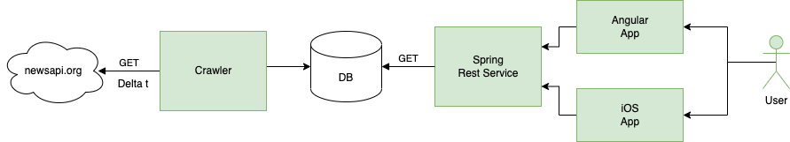

# News-aggregator

## About

This application was created as a part of learning process for creating web-based enterprise application.

When the application is started it runs a scheduled task, that is searching through every article registered
by News API resource and returns news articles according to the given parameters.
Json responses, that we've got from the News API, are converted into a Java class called Article 
and are ready to be saved in the database. 
Each article has a generated ID value that makes it possible not to save article duplicates.
The REST web service is using many of the spring features like auto wiring and dependency injection.
Persistence Layer is using Spring Data, that turns classes into database table rows and back again,
mapping domain classes to DB tables.
The goal of the application is a possibility to interact with articles, that are saved in existing relational database.

## Main elements

News aggregator contains of three parts:
+ crawler 
  + scheduled task with get request from news-api:
    <https:newsapi.org/v2/top-headlines?country=ch&apiKey=XXX>
  + requested json files are saved in mariadb as converted entities
+ service 
  + get entities from existing mariadb
  + return them as json files under the link
    + localhost:8080/articles
+ mariadb



## Instructions to Run application.
The application uses docker-compose.yml file to run 
three images of crawler/service/mariadb as separate docker containers.
+ Add environment variables in Compose file
  + Save all sensitive information such as api key in .env file:
    ```console
      news-aggregator: ~$ cat .env 
    
      API_KEY=XXX 
      MARIADB_USER=user
      MARIADB_PASSWORD=password
      ```
  + Put placeholders at the approprate places:
    ```console
      news-aggregator: ~$ cat docker-compose.yml
    
      version: "3.7"
       services:
      ...
         environment:
          KEY: "${API_KEY}"
          SPRING_DATASOURCE_USERNAME: "${MARIADB_USER}"
          SPRING_DATASOURCE_PASSWORD: "${MARIADB_PASSWORD}"
      ...
        maria_db:
         environment:
          MARIADB_USER: "${MARIADB_USER}"
          MARIADB_PASSWORD: "${MARIADB_PASSWORD}"
      ...
      ```
  + Verify this with the config command, which prints your resolved application config to the terminal:
      ```console
      news-aggregator: ~$ docker-compose config
    
      version: "3.7"
       services:
      ...
         environment:
          KEY: XXX
          SPRING_DATASOURCE_USERNAME: user
          SPRING_DATASOURCE_PASSWORD: password
      ...
        maria_db:
         environment:
          MARIADB_USER: user
          MARIADB_PASSWORD: password
      ...
      ```
+ Run the docker compose with following command. You do not need to mention .env file.
  + $ docker-compose up -d
